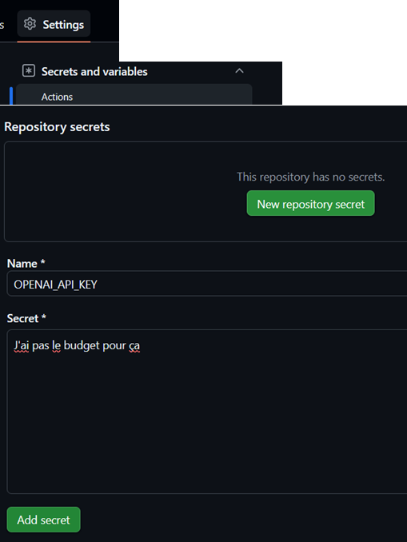

## CI/CD avec GitHub Actions 2. Sécurité et Secrets 

### Question A




### Question B

```yaml
      - name: Deploy application
        if: startsWith(github.ref, 'refs/tags/v')
        env:
          OPENAI_API_KEY: ${{ secrets.OPENAI_API_KEY }}
        run: |
          echo "Déploiement en cours..."
```